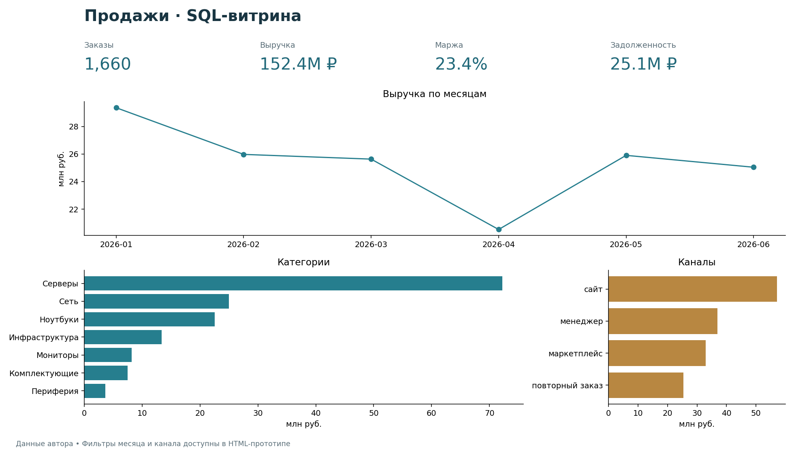

# SQL-анализ продаж и интерактивный дашборд

[English](README_EN.md) · [Открыть дашборд](https://druzhinskaia.github.io/portfolio-projects/04-sql-bi-dashboard/dashboard/)

Собственные данные автора по заказам, строкам продаж, клиентам, продуктам и оплатам. Задача — построить согласованную витрину продаж и задолженности, проверить расчёты и представить срезы по месяцам и каналам.

## Реализация

SQLite: пять таблиц с первичными и внешними ключами и проверками диапазонов. `sql/03_views.sql` сначала агрегирует строки и оплаты до заказа, затем соединяет их. Отсутствующая оплата считается нулевой, заказ сохраняется. Неотменённые заказы участвуют во всех показателях. Остаток задолженности и переплата показаны отдельно.

`sql/03_analytics_queries.sql` создаёт пять результатов: KPI, месяцы, категории, клиенты с задолженностью и рейтинг каналов (оконная функция RANK). Маржа взвешена по выручке; средний чек считается по заказам.

HTML/JavaScript-прототип использует выгруженную витрину. Фильтры **месяц и канал** пересчитывают все карточки и таблицы. Есть русский и английский интерфейс; используется локальный `data.js`, поэтому HTML можно открыть двойным щелчком без сервера. Это браузерный прототип, отдельного файла Power BI в проекте нет.

## Воспроизведение

Python 3.10–3.12, стандартная библиотека; сторонние Python-пакеты не требуются. Из корня репозитория:

```bash
python scripts/build.py
python -m unittest discover -s tests -v
# Для проверки JavaScript нужен Node.js 18+:
node tests/test_dashboard.cjs
```

Затем открыть `dashboard/index.html`. Сборка читает существующие CSV, обновляет SQLite-базу, пять CSV результатов и `dashboard/data.js`. Исходные CSV не меняются. Новая база создаётся во временном файле и заменяет итоговую после успешного построения. Ошибка схемы, дат, обязательных значений, внешних ключей или отсутствие строк заказа останавливает сборку.

Альтернатива через SQLite CLI 3.32+ из корня репозитория:

```bash
sqlite3 data/retail_sales.db
```

Внутри CLI: `.read sql/01_schema.sql`, `.read sql/02_load_data.sql`, `.read sql/03_views.sql`, `.read sql/03_analytics_queries.sql`. Это проверяет SQL; для экспорта файлов дашборда используйте Python-сборку.

## Проверяемый результат

1 660 неотменённых заказов; выручка 152 442 883 руб.; остаток задолженности 25 128 577 руб. Проверяются контрольные суммы, отсутствующие и дополнительные оплаты, переплаты, внешние ключи, все каналы и совместные фильтры.



## Ограничения и модель оплат

В текущем источнике одна запись оплаты на заказ. Дополнительные записи допустимы как отдельные непересекающиеся события оплаты; повторные накопительные снимки нельзя суммировать. Это нужно согласовать при подключении нового источника. Нет payment_date и истории снимков, поэтому фильтр месяца означает месяц заказа с **текущим остатком**, а не задолженность на конец того месяца. due_date без среза не доказывает просрочку. Скидка не применяется повторно к уже рассчитанной line_revenue. Отменённые заказы и возвраты не объединяются без правил источника. Рейтинг выручки каналов не измеряет рентабельность маркетинга: рекламных затрат нет.
